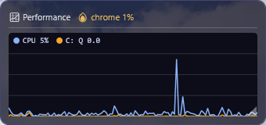
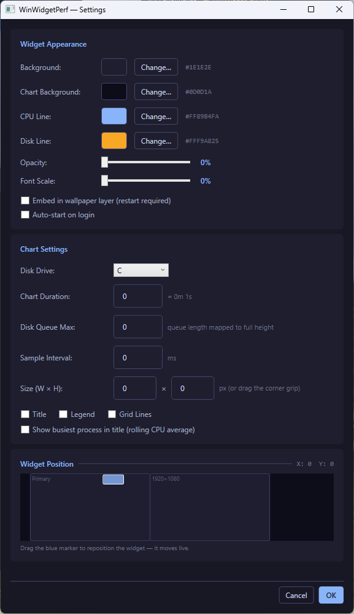
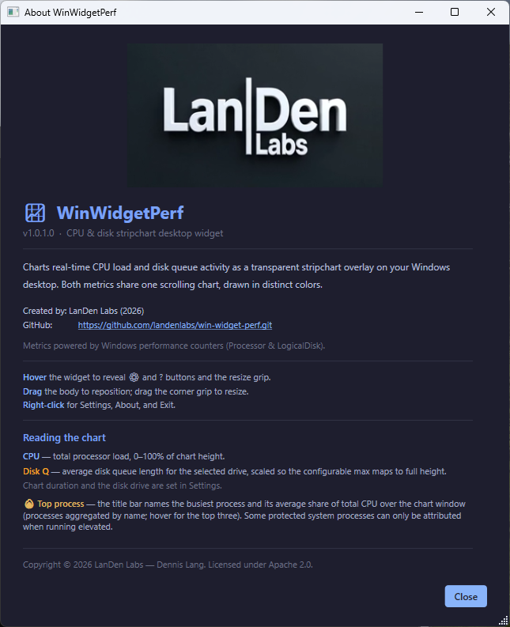

<table border="0">
  <tr>
    <td>
      07-Jun-2026<br>
      Windows<br>
      <a href="https://landenlabs.com/index.html">Home</a>
    </td>
    <td>
      <a href="https://landenlabs.com/index.html">
        
      </a>
    </td>
  </tr>
</table>

# WinWidgetPerf

[](https://github.com/landenlabs/win-widget-perf/actions/workflows/build.yml)


A lightweight Windows desktop widget that charts real-time **CPU load** and **disk queue activity** as a transparent scrolling stripchart directly on your desktop wallpaper. Both metrics share one chart, drawn in distinct colors. Built with WPF and .NET 10.

**By [LanDen Labs](https://github.com/landenlabs) (2026)**

---

## Screenshots

**Widget**



The title bar names the busiest process and its average share of total CPU over the chart window — `🔥 chrome 1%` above. The legend shows the current CPU load (blue) and disk queue length (amber).

**Settings dialog**



**About dialog**



---

## Features

- **Dual-metric stripchart** — CPU load (0–100%) and disk queue activity on a single scrolling chart, each in its own color
- **Busiest-process readout** — the title bar names the process consuming the most CPU using a rolling average over the chart window, aggregated by name (all `chrome` children sum together); hover for the top three
- **Per-drive disk monitoring** — pick any fixed drive (defaults to `C`); plots the average disk queue length, scaled so a configurable maximum maps to full chart height
- **Configurable duration** — set the total time span shown across the chart (default 2 minutes)
- **Resizable** — drag the corner grip to resize the widget, or set an exact size in Settings; the chart re-flows to fit
- **Transparent overlay** — sits directly on the desktop wallpaper, no taskbar clutter
- **Drag to reposition** — click and drag the widget anywhere on the desktop *(Windows 11)*
- **Screen-map position picker** — drag a scaled widget marker across a miniature monitor map inside Settings to reposition the widget *(Windows 10 & 11 — see [Windows 10 notes](#windows-10-notes))*
- **Multi-monitor aware** — position saved per monitor layout
- **Fully customizable** — background, chart background, CPU and disk line colors, opacity, font scale, sample interval, and component visibility (title, legend, grid lines, top process)
- **Multiple widgets** — add or remove widget instances from the system tray menu
- **Wallpaper embed mode** — render the widget at the wallpaper layer (below all windows)
- **Auto-start on login** — optional launch with Windows
- **Dark theme** — Catppuccin Mocha palette throughout
- **Persistent settings** — saved to `%AppData%\WinWidgetPerf\settings.json`

---

## Requirements

- Windows 10 or Windows 11
- [.NET 10.0 Desktop Runtime](https://dotnet.microsoft.com/en-us/download/dotnet/10.0) — install once; no SDK required

Metrics are read from Windows performance counters (`Processor` and `LogicalDisk`) and per-process CPU times. Running non-elevated, a few protected system processes cannot be attributed to the busiest-process readout — run elevated to include them.

---

## Windows 10 Notes

### Drag limitation

On **Windows 10**, the desktop widget cannot be dragged directly on screen. This is caused by a Windows 10 incompatibility between WPF's `AllowsTransparency` and `WindowStyle="None"` — the combination that transparent widgets require. The drag operation silently fails, and wallpaper-embed mode is unavailable.

**Windows 11** does not have this limitation; direct drag and wallpaper embedding work normally.

### Workaround — Screen-map position picker

Open **Settings** (hover the widget and click ⚙, or right-click → Settings) and scroll to the **Widget Position** panel:

```
Widget Position ─────────────────────────────── X: 120  Y: 200
┌──────────────────────────────────────────────────────────────┐
│  ┌────────────────────────────┐  ┌─────────────────────┐    │
│  │  Primary                   │  │  2560×1440          │    │
│  │        ▓▓▓▓▓               │  └─────────────────────┘    │
│  └────────────────────────────┘                              │
└──────────────────────────────────────────────────────────────┘
  Drag the blue marker to reposition the widget — it moves live.
```

- The canvas shows **all connected monitors** scaled to fit
- The **blue marker** represents the widget at its current position
- Drag the marker to the desired location — **the widget moves live** as you drag
- Click **OK** to keep the new position, or **Cancel** to restore it

This approach works on Windows 10 because the Settings dialog is a normal opaque window that does not require transparency.

---

## Installation

### Option A — Download release zip

1. Go to [Releases](https://github.com/landenlabs/win-widget-perf/releases)
2. Download `WinWidgetPerf.zip`
3. Extract to any folder (e.g. `C:\opt\bin\winwidgets\`)
4. Run `WinWidgetPerf.exe`

> The release zip contains a single self-contained `WinWidgetPerf.exe` plus an `Assets\` folder.  
> You must have [.NET 10.0 Desktop Runtime](https://dotnet.microsoft.com/en-us/download/dotnet/10.0) installed.

### Option B — Build from source

```cmd
git clone https://github.com/landenlabs/win-widget-perf.git
cd win-widget-perf
install.bat
```

The `install.bat` script publishes the project and copies the output to `C:\opt\bin\winwidgets\`.

---

## Usage

| Action | Result |
|--------|--------|
| **Hover** | Reveals ⚙ Settings and ? About buttons, and the corner resize grip |
| **Drag body** | Repositions the widget *(Windows 11 only — use Settings on Windows 10)* |
| **Drag corner grip** | Resizes the widget |
| **Hover title** | Tooltip lists the top three CPU-consuming processes |
| **Right-click** | Opens context menu (Resource Monitor / Settings / About / Remove / Exit) |

---

## Reading the chart

| Series | Meaning |
|--------|---------|
| **CPU** (blue) | Total processor load, 0–100% of the chart height |
| **Disk** (amber) | Percent of time the selected drive was active/busy, 0–100% of the chart height (matches Task Manager's disk "% Utilization") |
| **🔥 Top process** | The busiest process and its average share of total CPU over the chart window (processes aggregated by name) |

---

## Settings

Access via right-click → **Settings** or the tray icon menu.

### Widget Appearance

| Setting | Description |
|---------|-------------|
| Background | Widget background color |
| Chart Background | Plot-area background color |
| CPU Line | Color of the CPU trace |
| Disk Line | Color of the disk-active trace |
| Opacity | Background transparency 0–100% — updates live |
| Font Scale | Text size 50–200% — updates live |
| Embed in wallpaper layer | Places widget behind all windows (requires restart) |
| Auto-start on login | Launch the widget when Windows starts |

### Chart Settings

| Setting | Description |
|---------|-------------|
| Disk Drive | Fixed drive whose activity is charted (default `C`) |
| Chart Duration | Total time span shown across the chart, in seconds (default 120 = 2 min) |
| Sample Interval | How often metrics are sampled (milliseconds) |
| Size (W × H) | Exact widget size in pixels (or drag the corner grip) |
| Title / Legend / Grid Lines | Toggle each chart element |
| Show busiest process in title | Toggle the rolling-average top-process readout |

### Widget Position

A miniature map of your monitor layout. Drag the **blue marker** to move the widget anywhere on any screen. The widget repositions live as you drag. Changes are applied on **OK** and reverted on **Cancel**.

Settings are saved to `%APPDATA%\WinWidgetPerf\settings.json`.

---

## Building from Source

### Prerequisites

- [.NET 10 SDK](https://dotnet.microsoft.com/en-us/download/dotnet/10.0)
- Windows (WPF requires a Windows build host)

### Build

```cmd
dotnet build WinWidgetPerf.csproj -c Release
```

### Publish (FDD single-file, win-x64)

```cmd
dotnet publish WinWidgetPerf.csproj -c Release -r win-x64 --self-contained false -p:PublishSingleFile=true
```

Output: `bin\Release\publish\`

This produces a **single `WinWidgetPerf.exe`** (all managed assemblies bundled) plus the `Assets\` folder. Users need only the .NET 10 Desktop Runtime — no SDK required.

### Build and install via batch script

```cmd
install.bat
```

Kills any running instance, publishes, and copies all files to `C:\opt\bin\winwidgets\`.

---

## Project Structure

```
WinWidgetPerf/
├── Models/
│   ├── AppSettings.cs           # App and widget settings models
│   ├── DisplayConfiguration.cs  # Multi-monitor position tracking
│   └── PerfSample.cs            # One chart point (CPU + disk queue)
├── Services/
│   ├── PerfService.cs          # CPU load + per-drive disk queue (perf counters)
│   ├── ProcessCpuService.cs    # Rolling per-process CPU, busiest-process ranking
│   ├── DesktopService.cs       # Wallpaper embed / Win32 window helpers
│   ├── DisplayService.cs       # Per-monitor position save/restore
│   ├── SettingsService.cs      # JSON settings persistence
│   ├── AutoStartService.cs     # Run-on-login registry entry
│   └── TrayIconService.cs      # System tray icon and menu
├── Windows/
│   ├── AboutWindow.xaml        # About dialog
│   ├── ColorPickerWindow.xaml  # Color picker dialog
│   ├── SettingsWindow.xaml     # Settings dialog (incl. screen-map position picker)
│   └── WidgetWindow.xaml       # Main widget overlay with stripchart
├── Assets/
│   ├── landenlabs.mp4          # Animated logo (About dialog)
│   └── landenlabs.png          # Static logo fallback
└── install.bat                 # Build and install script
```

---

## License

Apache 2.0 © [LanDen Labs](https://github.com/landenlabs) 2026
